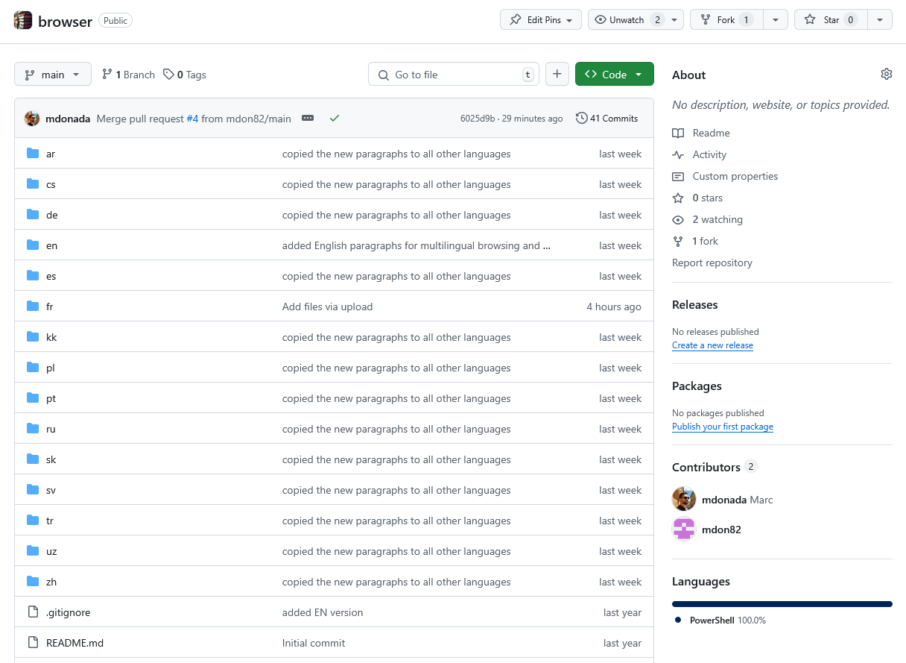
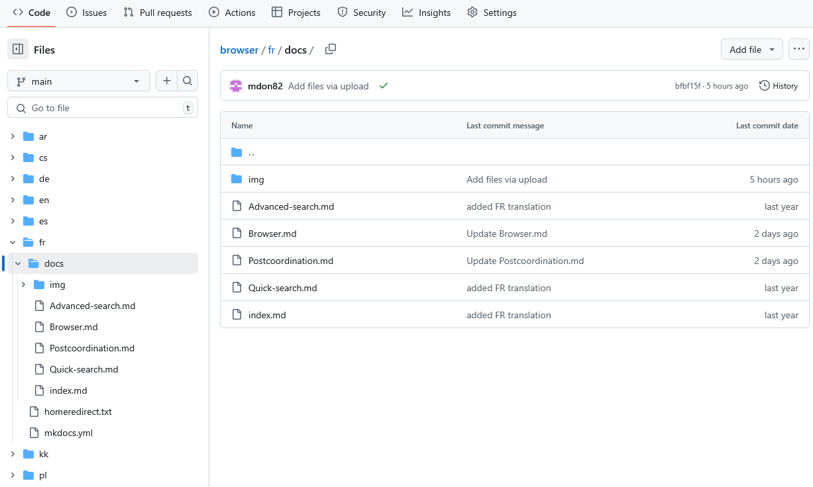

# Online Document Translation Guide

The online **Documentation** for **WHO-FIC classification tools**, such as the [ICD-11 Browser User Guide](https://icd.who.int/docs/browser/en/Browser/) and the [ICD-11 Coding Tool User Guide](https://icd.who.int/docs/codingtool/en/Searching/), are based on GitHub *repositories*.

GitHub is a web platform on which you can store, share, and collaborate with others to write and modify files.

A GitHub *repository*, often shortened to "repo," is a space where your project files and their revision history are stored. It acts as a container for your project's code, documentation, and other resources, allowing you to manage, share, and collaborate on software development projects.

For those who need to translate this documents, you'll need to use the GitHub website. This guide will walk you through the process step by step. 

## Online Documentation for WHO-FIC tools

Each row in the table below lists a WHO-FIC tool online Documentation and its GitHub repository.

|                               | Online Documentation                              | GitHub Repository                      |
|-------------------------------|---------------------------------------------------|----------------------------------------|
| ICD-11 Browser User Guide     | [https://icd.who.int/docs/browser/en/Browser/](https://icd.who.int/docs/browser/en/Browser/)      | [https://github.com/ICD-Docs/browser](https://github.com/ICD-Docs/browser)    |
| ICD-11 Coding Tool User Guide | [https://icd.who.int/docs/codingtool/en/Searching/](https://icd.who.int/docs/codingtool/en/Searching/) | [https://github.com/ICD-Docs/codingtool](https://github.com/ICD-Docs/codingtool) |
| DORIS system                  | [https://icd.who.int/docs/doris/en/](https://icd.who.int/docs/doris/en/)                | [https://github.com/ICD-Docs/doris](https://github.com/ICD-Docs/doris)      |

## Repository overview

**Important**: The following documentation covers the translation of the Browser User Guide. Each step is also applicable to the others documentation.

Below the *repository* organization for ICD-Docs/browser. Here's a breakdown of the key components:

- Language Directories: There are separate directories for different languages, such as **ar** (*Arabic*), **cs** (*Czech*), **de** (*German*), etc... Each directory contains the translated documentation for that specific language.
- Common Files: Files like .gitignore, README.md, etc... These files are used for configuration, documentation, and automation scripts. **Do not modify**.

Each language directory contains files specific to that language's translation of the user guides. For example, the **fr** (*French*) directory includes:

-  The markdown files (`.md` files) in the folder `browser/fr/docs/`. These are the documents to translate.
-  The screenshots images (`.png` files) in the folder `browser/fr/docs/img/`. These are the images used as screenshots in the documents
       

