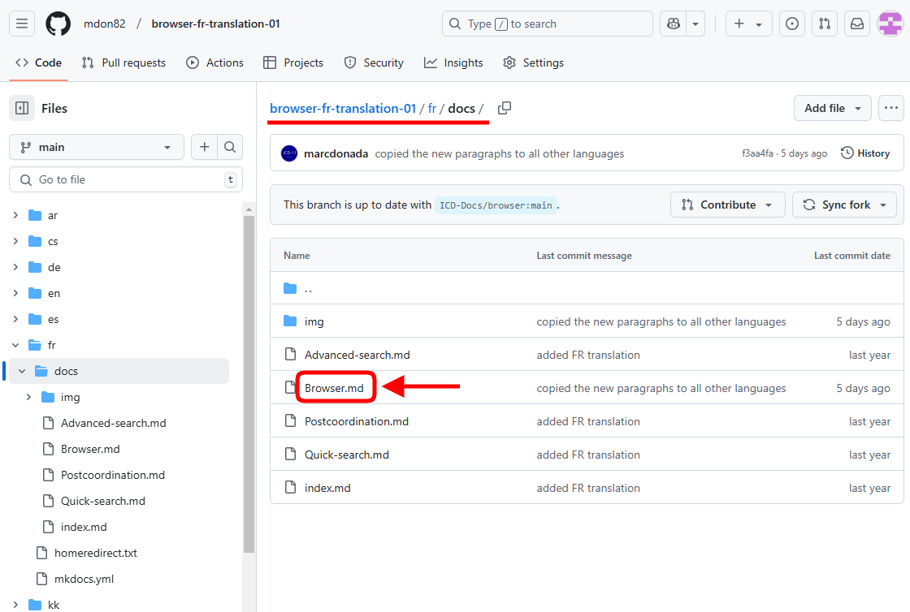
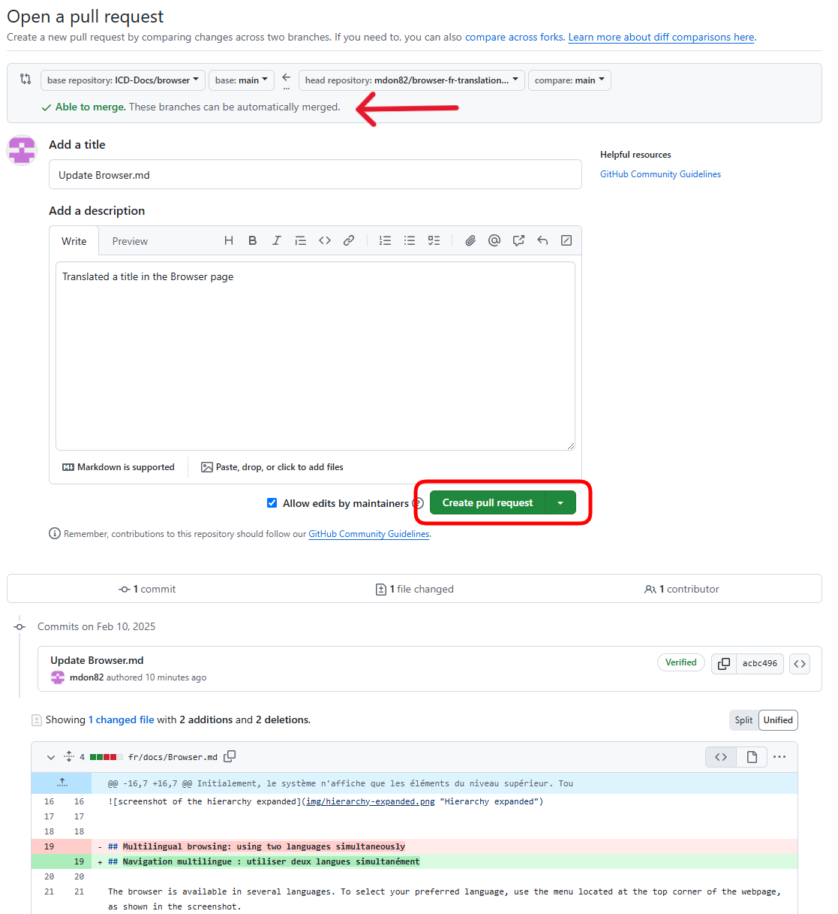

# How to Translate the documentation

The list below shows the steps you need to follow to translate the documentation into another language.

- [Create an account on GitHub](#create-an-account-on-github): Sign up for a GitHub account if you don't already have one. This account will allow you to access repositories, fork them, and make changes.
- [Fork the Repository](#fork-the-repository): Create a personal copy of the repository on your GitHub account. This way, you can make changes without affecting the original repository (i.e. all the changes you made will be done in your copy).
- [Make the Translation](#make-the-translation): This involves the actual process of translating the documentation. It includes two sub-steps:
    - [Edit the files](#edit-the-files): Open the markdown (.md) files you need to translate and make the necessary changes. We already provide a copy of the English version here so that you need to overwrite the text without changing the markup.
    - [Upload the screenshots](#upload-the-screenshots): If the documentation includes images or screenshots, upload translated versions of these as well.
- [Pull request](#pull-request): Submit your changes to the original repository. The repository owner can review your changes and decide whether to merge them into the main documentation.
- [Keeping translations up to date](#keeping-translations-up-to-date): This is needed to keep your forked repository up-to-date with the original repository. This ensures that you have the latest changes from the original project. This is not needed in the first translation but rather before catching up with updates made in the original translation

## Create an account on GitHub

- Navigate to [https://github.com](https://github.com)
- Click **Sign up**.
- Follow the prompts to create your personal account.

During sign up, you'll be asked to verify your email address. Without a verified email address, you won't be able to complete some basic GitHub tasks, such as creating a *repository*.

## Fork the Repository

A fork in GitHub is a copy of a repository that you can make changes to without affecting the original repository. 

Log in to your GitHub account if you haven't already and locate the repository you want to use. For example [https://github.com/ICD-Docs/browser](https://github.com/ICD-Docs/browser) for translating the **ICD-11 Browser User Guide**      

Click on the "**Fork**" button in the top right corner. 

By default, forks are named the same as their original repositories. To further distinguish your fork, you can optionally type a new name in the "**Repository name**" field. 

Select "**Copy the main branch only**".

Click  "**Create fork**".

The fork will create a copy of the original repository under your own GitHub account.

## Make the Translation

### Edit the files

Go to your GitHub profile and locate the forked repository. In the example below we will translate content in French. Navigate to the `fr` folder. 

Browse the repository to find the file you wish to translate. For example the `Browser.md` file located in the `fr/docs` folder. 

Click on the file to open it in preview mode. Then, click the "**Edit**" button (pencil icon) at the top right of the file view. 

You can make the necessary translation changes directly in the web editor. By toggling the switch "**Edit/Preview**" button, you can switch between the editor window and the preview window to see how the document will look. 

When you are satisfied with your translation, click the "**Commit** changes" button to save it. A commit on GitHub is a way to save changes to a repository. 

Enter a commit message describing your changes. Optionally, you can add an extended description of the changes.      
Select "**Commit directly to the main branch**" and click the "**Commit changes**" button to save your changes.

The translation you have made is now part of the file.

**Note**: If you need to translate additional files, please repeat these steps for each one.

### Upload the screenshots

In the example below, we will update a screenshot in French within the `Browser.md` file located in the `fr/docs` folder.  Follow these steps:

Locate the screenshot you wish to replace and switch from the Preview window to the Code window by clicking the "**Code**" toggle button.

In Markdown, images are represented using a specific syntax. In the example below, the screenshot's URL is `img/multilingual.png`, indicating that the image named `multilingual.png` is stored in the `img` folder.

Navigate to the `fr/docs/img` folder and locate the `multilingual.png` image file.

Click the "**Add file**" button and select "**Upload files**" from the dropdown menu.

Drag and drop the image file from your computer into the upload area. Alternatively, you can click "choose your files" to browse and select the image file from your computer.

**Important**: *The image file you are uploading must have the same file name and extension as the original image. In this example, it's* `multilingual.png`.

After the file is uploaded, you will see a form to commit your changes. Enter a meaningful commit message that describes the changes you are making and click "**Commit changes**" button

**Note**: If you need to upload additional screenshots, please repeat these steps for each one.

## Pull request

When you have completed translating the documentation, you can proceed with creating a **pull request**.

In the context of GitHub, a pull request is a mechanism for submitting your contributions to the original *repository*. It allows you to notify WHO-FIC team members that you have completed the translation. After submitting your pull request, the translations can be reviewed and merged into the main project. Here's how it works:

On GitHub, navigate to the main page of your forked repository, where you made the translations and/or uploaded the screenshot(s).

Click the "**Contribute**" button and select "**Open pull request**" from the dropdown menu.

GitHub will bring you to a page that shows the differences between your translated *repository* and the original *repository*.  

If you will see the green message "Able to merge", you can enter a title and a description for your changes. It's important to provide as much useful information and rationale as possible for why you're making this pull request.

Then, click the "**Create pull request**" button.

After you complete the pull request, GitHub will redirect you to the original repository where your pull request is listed, as shown in the example below.

**Note**: Your translation will be reviewed manually before being integrated into the documentation.

## Keeping translations up to date

After all these steps are completed and your translations are placed in the actual documentation, there may be updates made to the English version. In such cases you need to perform a **Sync fork** before updating your translations. You need to this only before incorporating changes made in the English version. So you don't need to do this after the initial translation

### Syncing a fork  

As explained above, when you fork a repository on GitHub, you create a copy of it in your own GitHub account. Over time, the original repository might get new updates or changes that you want to incorporate into your fork (for example, a new paragraph(s) in the documentation). 

**Sync Fork** is the process of updating your repository to include these changes, keeping it up to date with the original repository. 

To sync your fork on GitHub:

- Navigate to the main page of your repository that you want to sync with the original repository.
- Above the list of files, select the "**Sync fork**" dropdown menu.
- Review the details about the commits from the original repository, then click "**Update branch**".

This will merge the latest changes from the original repository into yours, ensuring it includes the most recent updates.

You can now begin translating the new paragraph(s) of the documentation.